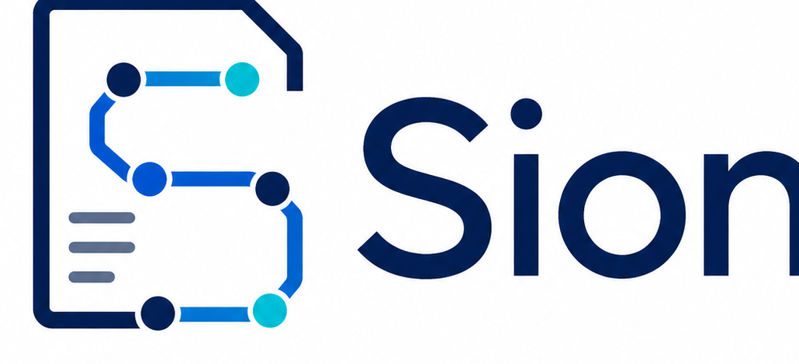

<div align="center">



[English](./README.en.md)


</div>

> 本地优先的 AI 项目设计文档桌面工作台。
>
> 面向小型外包项目、个人开发者和轻量团队，把零散需求、参考资料、节点 Agent 对话和 Markdown 交付稿组织成一条可交付的项目设计路径。

Sion 现为 macOS（Apple Silicon、Intel）与 Windows x64 桌面应用。Rust 负责项目数据、迁移、模型连接、文件提取和 Word 导出；React/Vite 仅提供工作台界面。

## 目录

- [适用场景](#适用场景)
- [核心能力](#核心能力)
- [快速开始](#快速开始)
- [使用流程](#使用流程)
- [设计节点](#设计节点)
- [模型配置](#模型配置)
- [附件与 Agent 交付](#附件与-agent-交付)
- [导出 Word](#导出-word)
- [旧数据迁移](#旧数据迁移)
- [本地数据与隐私](#本地数据与隐私)
- [构建与发布](#构建与发布)

## 适用场景

- 接到新项目，需要快速产出《项目开发设计文档》。
- 已有零散需求、会议纪要、客户说明或既有文档，需要整理成结构化章节。
- 希望每个设计阶段都有 Agent 协助追问、归纳和补全，但人工始终掌握最终写入权。
- 希望得到可编辑的 Markdown 工作稿，以及结构化的 Word 交付文档。
- 希望项目资料和模型密钥留在本机，而不是经过网页搜索或浏览器自动化服务。

## 核心能力

| 能力 | 说明 |
|---|---|
| **12 节点设计路径** | 从项目基本信息到最终文档，按依赖关系逐步推进。 |
| **节点 Agent 对话** | 每个节点有独立规则、会话和上下文，围绕当前章节工作。 |
| **可审阅的 Agent 交付** | Agent 输出受校验的 `delivery` 补丁；先预览完整结果，再确认写入。 |
| **并发保护** | 节点保存使用 revision/CAS，避免覆盖较新的工作稿；同一项目、同一节点只允许一个修改性 Agent 任务。 |
| **Markdown 工作稿** | 节点内容可直接编辑、保存并保留版本状态。 |
| **项目级规则覆盖** | 默认 Agent 规则嵌入应用；可为单个项目追加自定义规则，不会修改全局默认值。 |
| **本地文件池** | 导入 TXT、Markdown、JSON、CSV、PDF、DOCX、XLSX；可选择文件作为当前 Agent 的上下文。 |
| **安全模型配置** | 支持 OpenAI-compatible Chat Completions 与 OpenAI Responses；API Key 只写入系统凭据库。 |
| **结构化 Word 导出** | 将节点 Markdown 导出为含标题层级、目录、列表和表格的 DOCX。 |
| **旧项目迁移** | 将旧 Sion 项目原子迁移到新的 `.sion/` 存储，不恢复浏览器搜索状态。 |

## 快速开始

开发 Sion 需要 Node.js、Rust stable 和当前平台的 Tauri 系统依赖。macOS 上可直接运行；Windows 安装器应在 Windows 上构建。

```bash
# 1. 安装依赖
npm install

# 2. 启动桌面应用
npm run tauri dev
```

常用检查命令：

```bash
npm run lint                 # TypeScript 检查
npm run build                # 构建 React/Vite 工作台
npm run test:rust            # Tauri 命令层测试
cargo test --workspace       # Rust 领域与存储层测试
cargo clippy --workspace -- -D warnings
npm run test:no-browser-runtime
```

## 使用流程

1. 在启动页选择一个本地目录，创建项目；Sion 仅在该目录创建 `.sion/`。
2. 在“模型连接”中配置提供商与默认模型；离线编辑不需要模型配置。
3. 按左侧的 12 个节点整理设计内容，需要时导入资料并选中它们作为 Agent 上下文。
4. 与当前节点的 Agent 对话，预览其交付补丁，确认后再写入 Markdown 工作稿。
5. 在最终节点完成检查后，通过系统保存面板导出 DOCX。

## 设计节点

| 序号 | 节点 | 说明 |
|---:|---|---|
| 1 | 项目基本信息 | 记录项目名称、客户、编制方和项目边界。 |
| 2 | 需求背景与建设目标 | 明确项目背景、建设目标和范围边界。 |
| 3 | 用户角色与权限 | 梳理用户、角色、权限和职责。 |
| 4 | 业务流程设计 | 描述核心业务流程。 |
| 5 | 功能模块设计 | 拆分功能模块、子功能和业务规则。 |
| 6 | 页面与交互设计 | 定义页面清单、导航和关键交互。 |
| 7 | 数据结构设计 | 设计实体、字段和数据关系。 |
| 8 | 接口设计 | 定义服务接口与请求/响应约定。 |
| 9 | 技术架构与部署 | 确定技术栈、部署方案和依赖。 |
| 10 | 开发任务拆分 | 将设计转成可执行的开发任务。 |
| 11 | 待确认事项与风险 | 记录假设、风险和待确认问题。 |
| 12 | 最终文档生成 | 检查各章节并导出最终 Word 文档。 |

## 模型配置

Sion 支持 OpenAI-compatible **Chat Completions** 与 **OpenAI Responses** 协议。可配置 OpenAI、DeepSeek、通义千问、硅基流动及其他兼容服务，具体以提供商支持的协议为准。

在启动页的“模型连接”中填写：

- 提供商名称与 API Base URL；
- 协议：Chat Completions 或 Responses；
- 默认模型；
- API Key。

配置元数据保存在应用数据目录；API Key 只写入 macOS Keychain 或 Windows Credential Manager，界面不会回显密钥。

> Sion 桌面运行时没有浏览器搜索、浏览器自动化、Playwright 或网页抓取子系统。Agent 只基于当前节点、已选择附件和会话工作。

## 附件与 Agent 交付

导入的文件会复制进项目的 `.sion/files/`，原件与提取文本一起管理。支持的可提取格式包括 TXT、Markdown、JSON、CSV、PDF、DOCX 和 XLSX；提取失败会明确标记，不会伪装为可用文本。

Agent 回复中的写入内容必须是受约束的 fenced `delivery` JSON：默认只提交已有二级章节的分节补丁，完整重写必须由用户明确要求。应用会校验节点结构、展示变更预览，并使用当前 revision 保存；因此不会把流式过程中的半截内容直接写入项目。

## 导出 Word

从工作台的最终节点触发 DOCX 导出，并在系统保存面板选择目标位置。导出文档会保留 Markdown 的标题层级、项目标题和元数据、目录、无序/有序列表及管道表格，适合继续在 Word 中审阅和交付。

导出文件由用户选择位置保存；不会自动写入项目目录或上传到网络。

## 旧数据迁移

启动页可选择旧 Sion 工作区并逐个迁移项目。迁移过程先在同级临时目录完成校验，再原子写入目标项目的 `.sion/`：

- 保留项目元数据、12 个节点、聊天会话、附件、项目规则覆盖和历史导出；
- 旧提供商的 API Key 单独迁移至系统凭据库，新的元数据不保存明文密钥；
- 浏览器搜索配置、浏览器 profile/cache、网页抓取与自动 URL 读取不会迁移，也不会在新应用中启用；
- 如果目标目录已经存在 `.sion/`，迁移会拒绝覆盖。

迁移格式和 Golden 约束见 [fixtures/contracts/migration-expectations.md](fixtures/contracts/migration-expectations.md)。

## 本地数据与隐私

每个项目的数据只写入用户选择目录下的 `.sion/`：

```text
<项目目录>/
└── .sion/
    ├── manifest.json
    ├── nodes/
    ├── chat/
    ├── files/
    ├── agent-overrides/
    └── runs/
```

项目数据、附件、聊天记录和导出文件可能包含客户资料，不应提交到公共仓库。应用最近打开的项目注册信息与提供商元数据位于操作系统应用数据目录；密钥始终留在系统 Keychain / Credential Manager。

## 构建与发布

```bash
npm run build:desktop        # 当前平台：构建但不打包
npm run bundle:mac           # macOS：生成本机架构 App 与 DMG
npm run bundle:mac-universal # macOS：生成 Apple Silicon + Intel Universal App/DMG
npm run bundle:windows       # Windows：生成 NSIS 和 MSI 安装器
```

GitHub Actions 会在 Apple Silicon、Intel macOS 与 Windows x64 runner 上执行验证与打包。面向普通用户的安装包还需要平台代码签名；macOS 直链分发还需要 Apple 公证。具体步骤见 [RELEASE.md](RELEASE.md)。
